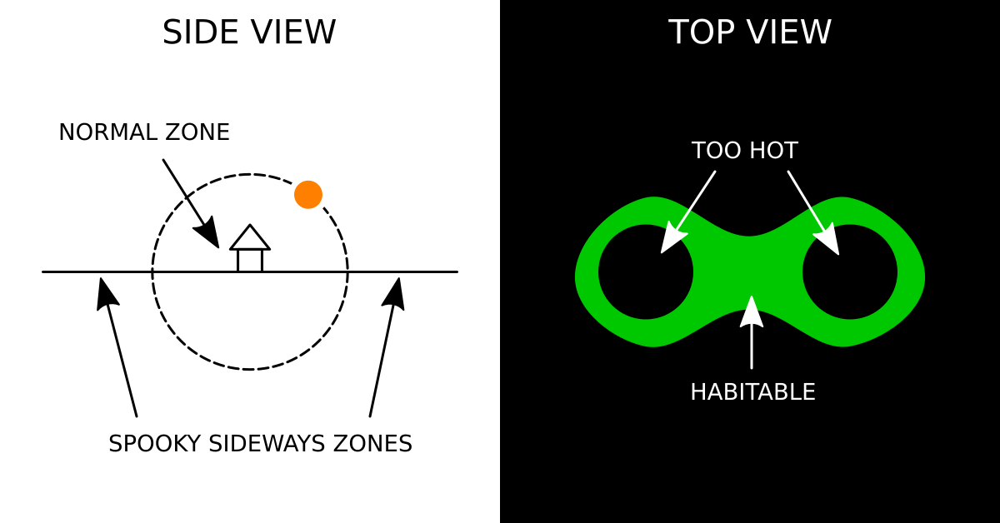

# Maui

The legendary hero Maui is said to have gone on a long journey across the world to the hole in the ground where the sun pops out every morning. I've found this idea fascinating ever since I heard the story as a kid.

What would the world look like if the model of the universe assumed in that legend were true? In broad terms, I imagine a flat earth with a burrowing sun would look something like this:

What would the climate and weather be like? Well, why not make a simple climate simulation to find out? This situation is vastly easier to reason about than the real Earth, because you don't have to fuss with spheres and you don't need to care about rotation.

I ended up writing this in JavaScript because it's a language I wanted to learn, not because I think it's an especially appropriate choice for this kind of project. I stopped when I produced a plausible-looking map showing what areas would be habitable, but there is of course much more that could be done in the future.

## Heightmap

For the shape of the earth, I wanted to produce a heightmap that looked natural and artifact-free, even if that meant sacrificing speed. For that reason I ditched the opportunity to use something like Perlin noise and instead used the following algorithm:

1. Initialize a 2-dimensional grid of `0`s, each number representing the altitude at its coordinate.
2. Select a randomly-sized and randomly-shaped circular region on the map.
3. "Stamp" the region by adding 1 or -1 to every grid square inside it. Which you do should be random, with 50/50 odds.
4. Repeat 2 and 3 a bunch of times.
5. Center the resulting distribution by applying an offset to all altitudes.
6. Crop out the edges to account for not being able to stamp regions hanging partway over the outer limits of the map.

I hoped that using randomly distributed circles would make the result look less square.

It looks okay on the macro scale, but zoomed in it does look pretty square after all, as if it were printed onto fabric with a low thread count. It's good enough, though, so I left it as-is.

## Temperature

Temperature in the real world is very complicated. In a flat world, it's still pretty tricky, but a lot of the obvious obstacles are gone.

There would be no atmospheric circulation cells because there would be no coriolis force. The temperature at any given spot on the map is mostly determined by the altitude and the distance from the sun... probably. It's possible that the sun literally dipping into the atmosphere on a daily basis would produce strong winds in a non-negligible non-random pattern, but my model doesn't account for this at all.

I pulled out some equations from my old physics classes, but they all assumed light coming from a single stationary point, when what I actually need is to model light coming from a point traveling in a semicircle. We could use calculus for this, but the math looks pretty gnarly to me, and this is the world of programming, where Riemann sums are cheap to calculate. So a Riemann sum I did.

I wondered whether higher altitudes might end up warmer instead of colder because the sun is so close, so I included altitude in the calculations. It doesn't seem to have mattered, though.

Estimating the rate of temperature decrease per altitude increase turned out to be very complicated and heavily dependent on the shape of the terrain. After hunting around for a while, I ended up finding a rule of thumb that just assumed the rate was constant, so I went with that.

## Habitability

I looked up the average temperatures of the most extreme permanent human settlements on Earth to come up with a habitable temperature range: (-15.5 °C, 34.4 °C)

Now all I needed to do was fiddle around with the scale of the numbers spat out by my calculations. If the value of 1 heat unit is too big or too small, none or little of the map will be temperate. I tried to maximize the habitability of the middle region as I picked this number.

The result:

(Red is too hot, blue is too cold, and green is habitable.)

Alas, this did not reveal any profound new information. It's very similar to my original sketch. But it sure does look cool.
